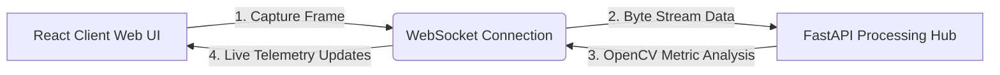

# 🤖 AI Interview Simulator with Emotion & Behavioral Analytics

> An intelligent, full-stack mock interview platform designed to evaluate and improve real-time candidate behavior. This application leverages a high-performance **Next.js** presentation layer and an asynchronous **FastAPI** computing engine connected over a low-latency **WebSocket** data pipeline.

---

### 🚀 Technology Stack & Badges


---

## 💡 Key Features

* **Real-Time Telemetry Streaming:** Captures and serializes webcam frames every **1000ms** to minimize browser overhead and prevent network congestion.
* **Dynamic Behavioral Metrics:** Calculates and streams immediate feedback on **Emotion Consistency**, **Eye Contact Percentage**, and **Vocal Stress Markers**.
* **Fault-Tolerant Processing Loop:** Uses frame-level isolation to prevent blurred images or dropped packets from terminating the active server connection.
* **Interactive Transcript Timeline:** Features a conversational chat UI with instant state management to track interview questions and answers seamlessly.

---

## 🛠️ System Architecture



* **Frontend Environment:** Built with **Next.js (App Router)** and **TypeScript** for robust type-safety. Tailored with a custom cinematic dark theme using **Tailwind CSS**.
* **Backend Processing Environment:** Powered by **FastAPI** and an asynchronous event loop running **Uvicorn** to support high-concurrency client connections.

---

## 📂 Project Directory Structure

```text
ai-resume/
├── backend/            # Python Machine Learning Backend
│   ├── venv/           # Isolated environment files
│   └── main.py         # WebSocket server & computation logic
└── frontend/           # Next.js Presentation Application
    ├── app/
    │   └── page.tsx    # Live telemetry & interview chat interface
    └── package.json    # Manifest file & script definitions

```

---

## ⚙️ Local Installation & Execution

Follow this clear execution order to launch the application components simultaneously using the Windows Command Prompt.

### 🧵 Step 1: Start the Machine Learning Backend

Open a terminal window, navigate to your backend repository directory, activate your isolated environment sandbox, and start your computation server:

```bash
cd Desktop/ai-resume/backend
venv\Scripts\activate
npx kill-port 8000
python main.py

```

> **Expected output anchor:** Verify that your console outputs: `Uvicorn running on http://127.0.0.1:8000`. Keep this window open.

### 🧵 Step 2: Spin Up the Interface Client

Open a **completely separate terminal window**. Change your target directory path to initialize your development workspace server:

```bash
cd Desktop/ai-resume/frontend
npm run dev

```

> **Expected output anchor:** Next.js will compile the dashboard assets and listen directly on port 3000: `http://localhost:3000`.

---

## 🎮 Running a Testing Session

1. Open your web browser and navigate directly to **`http://localhost:3000`**.
2. Click the teal **Start Session** button located in the upper right-hand corner of the page.
3. Accept the browser security prompt to authorize local video device access.
4. Your camera feed will switch to an active **LIVE DATA STREAM**.
5. Move your head, change your gaze angle, or look away from the screen to watch your dashboard metrics react dynamically in real-time.

---

## 📝 License

This project is open-source and licensed under the terms of the **MIT License**. Feel free to clone, modify, and distribute it as needed.

```

```
